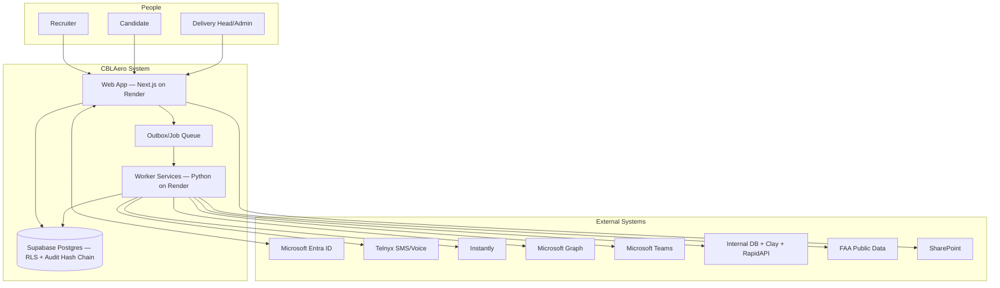
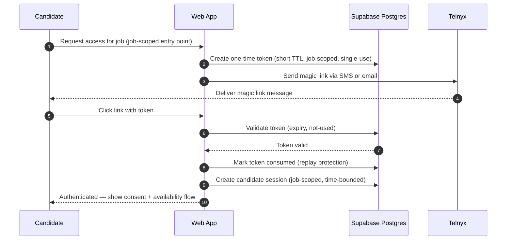
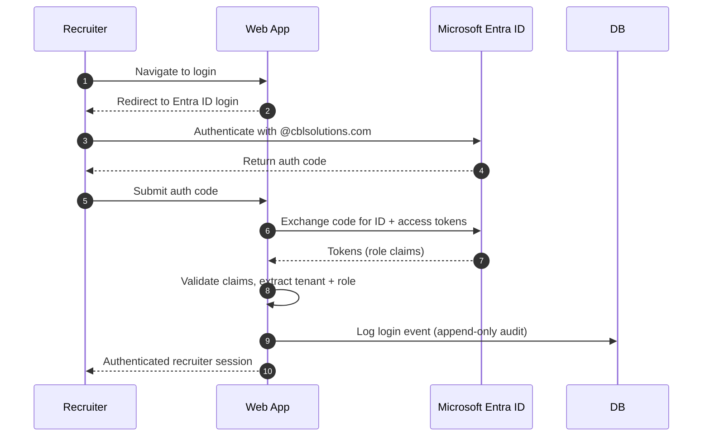
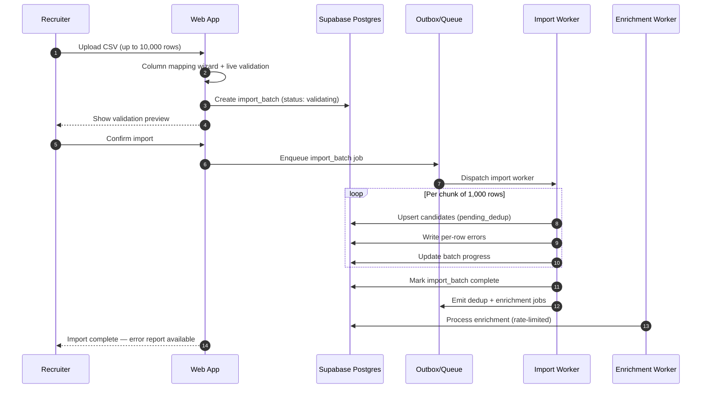
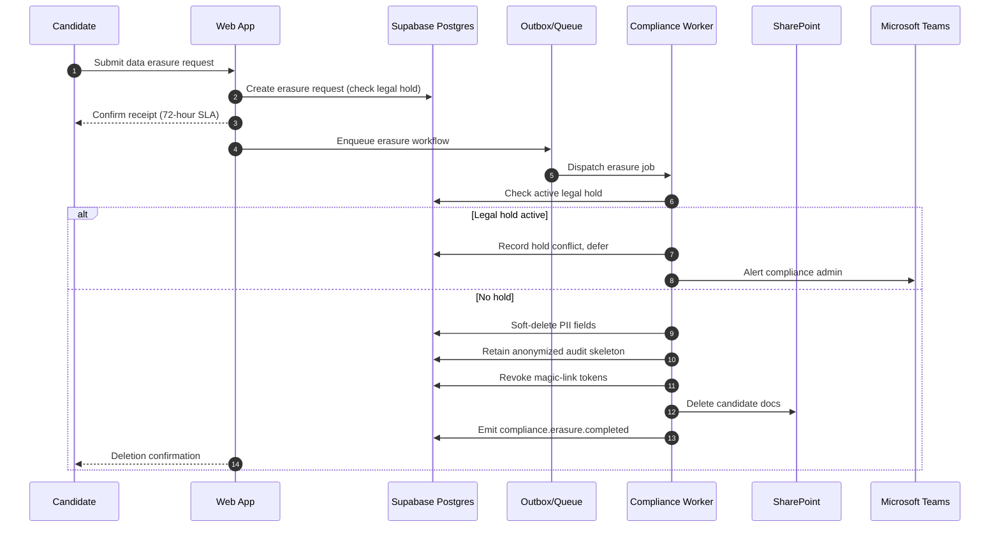

# Architecture Decision Document

_This document captures architecture decisions for CBLAero and is the implementation source of truth for AI agents. Full unabridged version preserved at `architecture.full.md`._

## Project Context Analysis

- 76 FRs across 3 tiers: candidate management, outreach/engagement, recruiter workflow, scoring/matching, delivery analytics, compliance/governance.
- NFRs: 99.5% uptime, 24-hour delivery SLA for 5 candidates, <1-minute notification latency, GDPR/CCPA/TCPA, SOC 2 trajectory, tamper-evident audit.
- Architecture classification: event-rich workflow system with strict multi-tenant data boundaries, compliance as first-order design.
- Tiered implementation: Tier 1 manual-heavy validation; Tier 2 automation; Tier 3 pilot hardening.
- Integration dependency on Microsoft Teams with outage fallback; candidate trust flow requires job-scoped opt-in and anti-abuse controls.
- Cross-cutting concerns: tenant isolation, auditability, consent/retention, queueing/idempotency, explainability, cost guardrails.

## Technology Stack

### Selected Starter: Next.js App Router Baseline

```bash
npx create-next-app@latest cblaero --typescript --eslint --tailwind --src-dir --app --import-alias "@/*"
```

Runtimes: Node.js v24 LTS · Next.js 16.x · Supabase Postgres (PostgreSQL 18-compatible) with `pgvector`. TypeScript-first, App Router, ESLint, `src/` layout. First story: initialize baseline then add auth/tenant middleware, module boundaries, and audit envelope before any feature implementation.

## Core Architectural Decisions

### Data Architecture

- Primary OLTP: Supabase Postgres (PostgreSQL 18-compatible).
- **Record scale:** 1M candidates at launch; 3M+ by Year 1. All queries/indexes/pagination must be designed for 1M+ rows from day one.
- Data strategy:
  - Relational core; Supabase is authoritative for session revocation, admin governance, audit streams.
  - `pgvector` schema in Supabase for tenant-scoped semantic retrieval and RAG.
  - Event outbox for reliable asynchronous publication.
  - Materialized read models for dashboards and SLA views.
  - Cursor-based pagination enforced on all candidate list endpoints (no offset pagination).
  - Composite partial indexes on `(tenant_id, availability_status)`, `(tenant_id, location)`, `(tenant_id, cert_type)`.
- Canonical entities: `tenant`, `user`, `role_assignment`, `candidate`, `candidate_identity_link`, `candidate_availability_signal`, `job_requirement`, `job_intake_question`, `candidate_match`, `outreach_message`, `consent_record`, `delivery_attempt`, `interaction_event`, `audit_event`, `teams_notification`, `import_batch`, `import_row_error`, `goal_states`, `candidate_outreach_lock`, `outreach_jobs`, `candidate_faa_verification`, `prompt_registry`, `trace_spans`, `pending_asset_deletions`, `provider_rate_counters`, `goal_approval_requests`, `gold_dataset_cases`, `logic_regression_runs`, `logic_regression_results`, `provider_routing_policies`, `provider_health_events`, `policy_registry`, `policy_versions`, `schedule_definitions`, `schedule_runs`, `synthetic_load_profiles`, `load_test_runs`, `rag_documents`, `rag_chunks`, `rag_embeddings`, `rag_queries`, `rag_citations`.
- Dedupe: Content Fingerprint Gate (see below); deterministic identity confidence thresholds; manual review queue; async post-import dedupe.
- Retention/deletion: policy-driven lifecycle with legal hold; GDPR erase workflow; voice call recordings retained 3 years.

### Datastore Decision Guide

| Data Type | Store | CBLAero Implementation |
|-----------|-------|----------------------|
| Structured/relational | Supabase Postgres | Candidates, users, jobs, audit events, config |
| Embeddings / semantic search | pgvector (in Supabase) | Candidate matching, RAG retrieval (tenant-scoped) |
| Files / attachments | Supabase Storage | Resumes, email attachments (`candidate-attachments` bucket) |
| Token / session cache | Module-level variables | Graph/Ceipal token (single-instance MVP; migrate to Redis if multi-instance) |

### Audit Log Immutability

All `audit_*` tables are append-only. Application roles have INSERT + SELECT grants only — no UPDATE or DELETE in production. Corrections recorded as new events. Retention minimum: 1 year for compliance-sensitive events. See development-standards.md §27.

### Correlation IDs / Distributed Tracing

Every request receives a `x-trace-id` (UUID) in `proxy.ts` middleware. This ID must be:
- Propagated to all downstream service calls (HTTP headers)
- Included in all audit events (`trace_id` field)
- Logged in all structured log entries
- Used as the primary key for end-to-end request tracing

### Observability & Logging Strategy

**Decision:** Progressive observability — start with structured stdout, add managed log drains as scale demands, defer self-hosted ELK until Epic 7+.

| Tier | Trigger | Stack | Cost |
|------|---------|-------|------|
| **1 — Current (Tier 1 MVP)** | Now | Structured JSON via `console.log(JSON.stringify({...}))` → Render stdout capture | Free |
| **2 — Log Drain** | Story 2.7 (scheduler) or multi-instance | Render → Logtail/Datadog/Papertrail log drain. No code changes. | Free tier |
| **3 — Managed Observability** | Epic 3+ (outreach, multi-service) | Grafana Cloud or Elastic Cloud. Add OpenTelemetry SDK. | Free tier or ~$50-100/mo |
| **4 — Full Stack** | Epic 7 (metrics/dashboards) | Elastic Cloud or self-hosted ELK. | ~$95+/mo |

**Rules for all tiers:**
- All logs MUST be structured JSON for job summaries, errors, LLM calls, auth events (see development-standards.md §23)
- Simple `console.log('[Module] message')` OK for dev/debug lines
- Correlation IDs (`x-trace-id`) included in all structured logs
- No code changes required between tiers
- Never add Elasticsearch/Kibana/Logstash as application dependencies

**What NOT to do:** do not self-host ELK for single-instance MVP; do not add logging SDKs (winston/pino/bunyan) until Tier 3; do not store logs in Supabase.

### Candidate Data Ingestion Architecture

Five ingestion paths funnel through one deduplication and enrichment pipeline.

**Unified Candidate Extraction Service:** All paths that extract candidate data from unstructured content share `candidate-extraction` in `features/candidate-management/application/`:

```typescript
extractCandidateFromDocument(
  content: Buffer | string,
  contentType: 'pdf' | 'email_body' | 'email_attachment',
  metadata: { source: string; tenantId: string; batchId?: string }
): Promise<CandidateExtraction[]>
```

- LLM prompt and extraction schema centralized (one structured-output schema).
- Content pre-processing pluggable per type (PDF text, email cleaning, etc.).
- API routes remain separate per upload type; they call the extraction service.
- New document types require only a new pre-processor + route.

**Path 1 — Initial bulk load (one-time):** 1M records via Python migration script from Render one-off job; chunks of 1,000 rows; rollback if >5% error rate per chunk; async dedupe post-load; enrichment as overnight batch at 100/sec.

**Path 2a — Recruiter CSV uploads:** Drag-and-drop with column mapping wizard and live validation preview. Max 10,000 rows/upload. Unmapped columns → `candidates.extra_attributes` (JSONB) with normalized keys, blocked sensitive keys (`password`, `token`, `secret`, `api_key`), per-row size limits. Per-row error report downloadable. Records enter `pending_enrichment`.

**Path 2b — Recruiter PDF resume uploads:** Upload page accepts one or many `.pdf` files. Each PDF stored in `candidate-attachments` bucket at `resume-uploads/{tenant_id}/{batch_id}/{filename}`. LLM extraction via unified service. Recruiter reviews extracted data before confirm. `candidate_submissions` row per PDF. **Scanned-image PDF support:** when `pdf-parse` returns no text, system falls back to Claude vision (`ocr+llm`, ~4x cost). Per-file errors flagged for retry/skip. Internal batches of 50 for cost/memory bounding. Supabase URL stored in `candidates.resume_url` (not submissions — submissions are email-only evidence).

**Path 3 — ATS connector and email inbox sync (Tier 2):**
- ATS connector: global scheduler emits `ats_sync.requested` jobs at ≥15-minute intervals; worker polls ATS API and upserts through standard dedup pipeline with `source: ats_sync`.
- Email inbox parsing: scheduler emits `inbox_parse.requested` jobs; worker uses Microsoft Graph to fetch **unread** messages (`$filter=isRead eq false`), processes one at a time (stream, not batch), runs LLM extraction, uploads attachments, upserts candidate, marks read via Graph PATCH. Failures stay unread for automatic retry. Non-submissions classified by LLM are marked read and skipped.
- Both paths write `import_batch` with source attribution; sync errors alert admin.
- **Global scheduler (Story 2.7):** Single Render cron (`CBLAero-Scheduler-Tick`) fires every 10 minutes → `POST /api/internal/jobs/run` → `GlobalScheduler.runDueJobs()` + `processOutbox()`. Scheduler checks `next_run_at` for all 7 jobs. Per-job crons retired. Cadences code-defined in `registerIngestionJobs()` and synced to DB on bootstrap; admin UI displays as read-only labels.

**Path 5 — Clay webhook ingestion (Story 2.8):**
- Inbound push; `POST /api/webhooks/clay` receives per-row pushes, no polling. Auth: `Authorization: Bearer {CLAY_WEBHOOK_SECRET}` (401/400/413 on bad token/JSON/size>256KB).
- **Payload (confirmed 2026-04-15):** `{ enrichlinkedin_data: {...}, email, phone }`. Accepts single/array/`{rows:[]}`. Nested blob + sidecar fields configurable via env vars.
- **Field mapping:** core LinkedIn fields → typed columns; full payload under `candidates.extra_attributes.clay.*`. Sidecar `email` is dedup key.
- **Content fingerprint:** `clay:${profile_id}:${last_refresh}` under `fingerprint_type='ats_external_id'`. Replay = guaranteed no-op.
- **Shared path:** delegates to `batchUpsertCandidatesFromATS`. `mapToCandidateRow` extended with `sourceRecruiterActorId`.
- **Provenance:** stamped `source: 'clay_enrichment'`, `source_recruiter_actor_id` from `CLAY_DEFAULT_ASSIGNEE_EMAIL`. If unresolved → HTTP 503 (fail-loud).
- **Sync runs:** Clay is the **only** source aggregated into **hourly buckets** via `upsert_clay_hourly_sync_run` RPC (ON CONFLICT DO UPDATE). Partial unique index scoped to Clay. RPC invoked once per request; RPC failures swallowed (observability never blocks ingestion).
- **Residency:** startup-time check means webhook writes guaranteed approved-region.
- **Debug:** `CLAY_WEBHOOK_DEBUG=true` dumps raw payload during rollout.
- **Backfill:** re-fire Clay HTTP API column via "Run on all rows"; fingerprint idempotency prevents duplicate work.
- **Provenance preserve-if-set merge:** `source_recruiter_actor_id` uses `coalesce(existing, excluded)` in `upsert_candidate_batch` ON CONFLICT branch. **Canonical pattern: write-once via RPC coalesce, not application read-before-write.**

**Clay flow direction:** Story 2.8 is the **inbound** flow. Separate *outbound* Clay enrichment flow (CBLAero → Clay) is tied to Epic 5 scoring and remains unimplemented. Two distinct flows share the provider.

### Content Fingerprint Gate

**Decision:** No ingestion path may invoke LLM extraction, enrichment, or database upsert without first checking a centralized content fingerprint. Never spend compute on content you have already seen.

```sql
create table if not exists cblaero_app.content_fingerprints (
  id bigint generated always as identity primary key,
  tenant_id text not null,
  fingerprint_type text not null check (fingerprint_type in (
    'file_sha256', 'email_message_id', 'csv_row_hash', 'ats_external_id', 'candidate_identity'
  )),
  fingerprint_hash text not null,
  source text not null check (source in ('email', 'ats', 'csv', 'ceipal', 'resume_upload', 'onedrive')),
  status text not null default 'processed' check (status in ('processed', 'failed')),
  candidate_id uuid references cblaero_app.candidates(id) on delete set null,
  metadata jsonb not null default '{}'::jsonb,
  created_at timestamptz not null default now()
);
create unique index if not exists uq_fingerprint_tenant_type_hash
  on cblaero_app.content_fingerprints (tenant_id, fingerprint_type, fingerprint_hash);
```

| Ingestion Path | Fingerprint Type | Hash Input | What It Skips |
|----------------|-----------------|------------|---------------|
| PDF resume upload | `file_sha256` | `SHA-256(raw file bytes)` | LLM extraction + DB upsert |
| Email ingestion | `email_message_id` | Graph API `message.id` | LLM extraction + submission insert |
| CSV row | `csv_row_hash` | `SHA-256(normalized: lower(email)\|lower(first+last)\|phone)` | DB upsert call |
| ATS sync (Ceipal) | `ats_external_id` | `ceipal:{applicant_id}` | Full sync processing |
| OneDrive resume poll | `file_sha256` | `SHA-256(raw file bytes)` | Download + LLM extraction |
| Candidate identity | `candidate_identity` | `SHA-256(lower(email))` or `SHA-256(lower(first+last)+normalized(phone))` | DB round-trip for known active candidates |

**`FingerprintService` interface:**

```typescript
interface FingerprintService {
  isAlreadyProcessed(tenantId: string, type: FingerprintType, hash: string): Promise<boolean>;
  recordFingerprint(tenantId: string, type: FingerprintType, hash: string, source: string, candidateId?: string, metadata?: Record<string, unknown>): Promise<void>;
  computeFileHash(content: Buffer): string;
  computeIdentityHash(email?: string, firstName?: string, lastName?: string, phone?: string): string;
}
```

**Pipeline order:** receive input → compute fingerprint → `isAlreadyProcessed()` → if processed, log skip + return (no LLM/DB) → else proceed → on success `recordFingerprint()` with candidate linkage → on failure `recordFingerprint(status='failed')` for retry.

**In-memory acceleration (Tier 2):** For batch paths, load recent fingerprints into `Set<string>` at batch start from `content_fingerprints WHERE ... AND created_at > now() - interval '30 days'`. False negatives fall through to DB; false positives impossible.

**Observability:** structured log on every skip: `{ event: 'fingerprint_hit', type, source, tenantId, hash: hash.slice(0,12) }`.

### Authentication and Security

- Candidate: one-time token links, short-lived verification step.
- Internal users: SSO-ready session model, step-up auth for sensitive operations.
- RBAC + tenant-scoped object checks on every read/write path.
- Signed token links, replay protection, strict expiry; rate limiting and abuse detection; PII encryption at rest and in transit; security actions to immutable audit stream.

### API and Communication Patterns

- External API style: REST with explicit resource scoping and contract versioning.
- Internal async: transactional outbox plus background workers.
- **Outbox implementation contract:**
  - A Postgres trigger (or app service) writes an `outbox` row **in the same transaction** as the state mutation. DB is single source of truth.
  - Dedicated relay worker polls `outbox` and publishes with retry, dead-letter, idempotency.
  - **Supabase Database Webhooks (`pg_net`) explicitly not used** as delivery mechanism — fire-and-forget, no backpressure, no DLQ, no ordering. OK for low-stakes internal notifications only.
- Response contract: success `{"data": ..., "meta": ...}`; error `{"error": {"code": "...", "message": "...", "details": ...}}`.
- Idempotency required on outreach scheduling and notification sends.
- Bounded retries with escalating delay and dead-letter classification.

### Global Scheduler Design

- Single global scheduler service owns all recurring business schedules (ATS sync, inbox parsing, candidate refresh sweeps, daily digests, nightly FAA re-verification, recalibration jobs, operational guardrail checks).
- State in Postgres, not process memory:
  - `schedule_definitions(schedule_id, tenant_id, schedule_type, target_ref, cadence_kind [interval|cron|fixed_local_time], cadence_value, timezone, next_run_at, last_run_at, paused_at, disabled_at, policy_version_id, created_by_actor_id, updated_by_actor_id, created_at, updated_at)`
  - `schedule_runs(run_id, schedule_id, tenant_id, scheduled_for, claimed_at, started_at, completed_at, status [claimed|completed|failed|skipped], emitted_outbox_event_id, worker_job_id, policy_version_id, error_code, error_summary)`
- Scheduler loop claims due rows via `FOR UPDATE SKIP LOCKED`, writes outbox event, records `schedule_runs`, advances `next_run_at` in same transaction.
- Scheduler never calls providers directly — emits to outbox/jobs; workers remain event-driven.
- **Cold-start resilience:** scheduler runs **in-process** inside Next.js (via `setInterval`), not external cron. Eliminates cold-start failures on Render free tier. Jobs call `.run()` directly (no HTTP round-trip).

### Schedule Taxonomy

- **Business schedule:** recurring product/ops cadence (ATS polling every 15 min, daily Teams digests, nightly FAA sweeps, 4-hour refresh). Owned by global scheduler.
- **Retry timer:** execution-local backoff after a failed attempt (provider retry, `Retry-After`, DLQ delay). Stays inside worker/job; not a scheduler entity.
- **Lock/cooldown:** domain-protection window (outreach cooldown, breaker cool-down). Enforced from domain state at execution time; not recurring jobs.

### Schedule Change Path

1. Admin changes cadence/state in UI.
2. Backend API validates tenant scope, allowed bounds, policy compatibility.
3. API writes versioned records to `policy_versions` and `schedule_definitions`.
4. Global scheduler picks up effective schedule.
5. Scheduler emits outbox jobs with effective `policy_version_id`.
6. Workers execute and record schedule run + policy version in audit/tracing.

### Agentic Control Plane and Worker Model

Goal-driven multi-agent execution model, not just background jobs.

**Control-plane agents:** Orchestrator (plan selection, conflict resolution, aggregation), Goal Manager (goal tracking, KPI monitoring, replanning), Global Scheduler (recurring cadence).

**Execution workers:** Sourcing, Matching, Outreach, Scheduling, Compliance, Cost Guardrail.

**Learning loop:** Reporting Agent (progress reports, structured feedback) and Coaching/Policy Tuning Agent (policy tuning with approval gates; no unsupervised fine-tuning in MVP).

**Decision governance:** all decisions traceable via correlation+tenant IDs; Orchestrator decisions in append-only event history; high-impact actions require HITL; Orchestrator uses deterministic arbitration when workers disagree; goals have `max_iterations` + `max_consecutive_failures` (see §1); cold-start tenants use bootstrap mode (§2); paused goals resume from scratchpad checkpoint (§9).

_Agentic architecture diagrams and agentic-execution sequence retained only in `architecture.full.md` — not yet implemented; re-draw when Epic 5+ begins._

### Frontend Architecture

- Next.js App Router UI with feature-bounded folders.
- Surfaces: Recruiter workspace, Candidate portal, Delivery lead console, Admin/compliance console.
- State: server-driven data for most views; client state only for transient workflow/UI.
- UX requirements: explicit rejection reasons and override traceability; progressive disclosure for high-volume sets; WCAG 2.1 AA baseline.

### Infrastructure and Deployment

- Web/API on Render; Python workers on Render background workers; Supabase Postgres (managed Postgres on Render not used); separate staging/production.
- CI/CD: tenant isolation test suite, migration/backward-compat checks, security/static analysis on protected branches.
- Observability: Render + Supabase native; structured logs with `trace_id`/`span_id`/`parent_span_id`; metrics for SLA/latency/queue depth/failures; alerts for fallback triggers, compliance failures, budget thresholds.
- Secrets: Render environment secrets only for MVP.

### Confirmed Integration System Matrix

| Capability | Selected System | MVP Notes |
|---|---|---|
| SMS (two-way) | Telnyx | Primary; Twilio warm standby supported, disabled by default |
| Voice calling | Telnyx Voice | Dial + call recording + transcription |
| Email campaigns | Instantly | Primary; degraded fallback to Graph for critical/manual messages |
| Ad hoc recruiter email | Microsoft Graph/Outlook | One-click recruiter email |
| Teams collaboration | Microsoft Teams | Notification cards, tasks, scheduling |
| Identity | Microsoft Entra ID + magic links | Internal SSO; SMS/email magic links for candidates |
| Candidate enrichment | Internal DB, Clay, RapidAPI | Provider-agnostic connector layer mandatory |
| FAA verification | Official FAA public data + manual | Third-party FAA API deferred |
| Background checks | Manual only | No API integration in MVP |
| Job queue and retries | Render background workers | Async + retry on workers |
| Monitoring and alerting | Render + Supabase native | No external APM in MVP |
| Secrets management | Render environment secrets | External vault deferred |
| Audit immutability | DB append-only + hash chain | Tamper-evidence in audit model |
| Document/file storage | SharePoint folder | `https://cblsolution-my.sharepoint.com/...` |
| Analytics/BI | In-app only | External BI deferred |

### C4 Container Diagram (MVP)



### Sequence: Candidate Magic-Link Authentication



### Sequence: Internal Recruiter SSO Login (Entra ID)



### Sequence: Bulk CSV Candidate Import (Recruiter Upload)



### Sequence: GDPR / CCPA Data Erasure Request



_Other sequence diagrams (outreach→notification, job intake→ranked delivery, Teams action→outreach, two-way SMS, Instantly campaign, enrichment pipeline, PDF resume, ATS sync, email inbox parsing, FAA manual verification, step-up auth, cost guardrail replan) preserved in `architecture.full.md`; re-draw when their epics start._

### Budget and KPI Alert Baselines

- API spend alert threshold: $1,000/month
- SMS cost alert threshold: $200/placement
- KPI breach alert threshold: conversion rate <5%

### Architecture Standards and Governance

**Standards:** C4 model, domain-oriented module boundaries, Twelve-Factor, OWASP ASVS L2 + API Top 10, zero-trust posture.

**Vector/RAG standard:** tenant-safe by design; pgvector in isolated schema; tenant + role filter before semantic ranking; prompt-injection detection + policy filtering; PII excluded from embeddings unless approved.

**MCP access control:** brokered through server-side policy gateway; allowlist per role + environment; actor/tenant/scope/trace on every invocation; step-up + audit for high-risk ops.

**Supabase access from Python:** backend-only; service-role key never in browser; candidate/recruiter paths use RLS tokens; per-env key scopes with rotation; least-privilege SQL roles; TLS with cert verification; admin SQL restricted to migration pipeline.

**SSL/TLS:** HTTPS-only with TLS 1.2+ (1.3 preferred); HTTP→HTTPS + HSTS on auth surfaces; DB TLS `sslmode=require` minimum, `verify-full` where supported; platform-managed certs (Render + Supabase).

**Related ADRs:** `docs/planning_artifacts/adr/` — 0001 security baseline, 0002 RAG/vector, 0003 MCP, 0004 Supabase-from-Python, 0005 TLS.

## Development Standards Reference

All stories must follow [development-standards.md](development-standards.md). Key areas: external API retry/backoff, LLM integration safety, data ingestion dedup, Supabase error handling, token caching, evidence preservation. Code reviews verify compliance.

## Implemented Capabilities Registry

_Dev agents: read this section BEFORE implementing any story. If a capability exists, reuse or extend — never recreate. After implementing a new reusable capability, add it here._

### Canonical Domain Types

_Dev agents: domain types live in feature-owned `contracts/` folders. Import from these — never redefine. After adding a new canonical type, add a row here._

| Entity | Canonical Location | Notes |
|---|---|---|
| Candidate (list + detail) | `src/features/candidate-management/contracts/candidate.ts` | `CandidateListItem`, `CandidateDetail`, `IngestionState`, list params/result |
| Dedup candidate shape | `src/features/candidate-management/contracts/dedup.ts` | `CandidateForDedup` |
| Availability | `src/features/candidate-management/contracts/availability.ts` | |
| Saved Search | `src/features/candidate-management/contracts/saved-search.ts` | |
| Candidate Submission | `src/features/candidate-management/infrastructure/submission-repository.ts` | Repository-owned type |
| Import Batch | `src/features/candidate-management/infrastructure/import-batch-repository.ts` | `ImportBatch`, `ImportBatchStatus`, `ImportRowError` |
| Sync Run | `src/features/candidate-management/infrastructure/sync-error-repository.ts` | `SyncRun` |
| Tenant Context | `src/modules/tenants/index.ts` | `TenantContext` |
| Ingestion Source enum | `src/modules/ingestion/index.ts` | `IngestionSource` union |
| Audit Events | `src/modules/audit/index.ts` | Per-event types |
| Provider types | `src/modules/providers/types.ts` | `BaseProviderClient`, `BaseWebhookReceiver`, health event, routing policy |

**Gaps (not yet formalized — create on first story need):** Recruiter/User (Epic 1 follow-up), Job/Requisition (Epic 3), Client entity (Epic 1 follow-up or Epic 8), AuditEvent base union type.

**Rule:** Each feature module MUST expose its domain types from `features/<feature>/contracts/<entity>.ts`. Cross-cutting enums/envelopes go in `modules/<module>/types.ts` or `modules/<module>/index.ts`. Repositories may own their row types if DB-shape-specific.

### HTTP & External APIs
| Capability | Location | When to Use |
|-----------|----------|-------------|
| `fetchWithRetry(url, init, opts)` | `src/modules/ingestion/fetch-with-retry.ts` | ALL external HTTP calls (Ceipal, Graph, OneDrive, Azure AD). 3 retries, exponential backoff, 429/5xx/network. |
| `acquireGraphToken()` | `src/modules/email/graph-auth.ts` | Microsoft Graph API calls. Caches with 60s buffer. |
| `acquireCeipalToken()` | `src/modules/ats/ceipal.ts` (internal) | Ceipal API calls. Caches with 5min buffer. |

### AI Inference Service
| Capability | Location | When to Use |
|-----------|----------|-------------|
| `getSharedAnthropicClient()` | `src/modules/ai/client.ts` | Shared Anthropic SDK singleton. ALL LLM usage — never `new Anthropic()` directly. |
| `callLlm(model, systemPrompt, userContent, opts)` | `src/modules/ai/inference.ts` | Centralized LLM wrapper: token counting, cost estimation, logging, anomaly detection, usage persistence. Accepts string or `ContentBlockParam[]` (multimodal). |
| `recordLlmUsage(entry)` | `src/modules/ai/usage-log.ts` | Persist per-call tokens + cost to `llm_usage_log`. Called by `callLlm()` (fire-and-forget). |
| `loadPrompt(name, version?)` | `src/modules/ai/prompt-registry.ts` | Load prompt from `prompt_registry` (DB-first, in-memory fallback). |
| `registerFallbackPrompt(record)` | `src/modules/ai/prompt-registry.ts` | Register inline fallback prompt when DB unavailable. |
| `clearClientForTest()` | `src/modules/ai/client.ts` | Reset singleton for test isolation. |
| `getAggregatedUsage(params)` | `src/modules/ai/usage-repository.ts` | Aggregate `llm_usage_log` by day/model/promptName. |
| `checkBudgetThreshold(thresholdUsd?)` | `src/modules/ai/budget-alert.ts` | Check today's AI spend against threshold (default $10/day). |
| `deprecatePrompt(name, version)` | `src/modules/ai/prompt-registry.ts` | Mark prompt version deprecated (append-only). |
| `updatePromptStatus(name, version, status)` | `src/modules/ai/prompt-registry.ts` | Update prompt to active/staged/deprecated. |
| `listPromptVersions(name)` | `src/modules/ai/prompt-registry.ts` | List all versions sorted by created_at desc. |

### CSV Parsing & Field Inference
| Capability | Location | When to Use |
|-----------|----------|-------------|
| `parseCsv(text)` | `src/modules/csv/index.ts` | Parse CSV into headers + rows. Handles quoted fields, embedded newlines, BOM, CRLF/CR/LF. |
| `splitCsvRows(text)` | `src/modules/csv/index.ts` | Split into logical rows respecting quoted fields. |
| `parseCsvLine(line)` | `src/modules/csv/index.ts` | Parse single row into cells, RFC 4180. |
| `inferFieldForHeader(header)` | `src/modules/csv/index.ts` | Auto-map header to canonical field via `FIELD_ALIASES`. |
| `normalizeHeaderKey(value)` | `src/modules/csv/index.ts` | Normalize header to lowercase snake_case. |
| `FIELD_ALIASES` | `src/modules/csv/index.ts` | 40+ header variations → canonical fields. |
| `CANONICAL_FIELDS` | `src/modules/csv/index.ts` | Set of valid canonical field names. |

### Candidate Data Pipeline
| Capability | Location | When to Use |
|-----------|----------|-------------|
| `extractCandidateFromDocument(input, type, opts)` | `src/features/candidate-management/application/candidate-extraction.ts` | LLM extraction from any doc (email, PDF, DOCX). Haiku 4.5, 10K char limit. Scanned PDFs auto-fallback to vision (`ocr+llm`). |
| `extractCandidateFromEmail(body, subject)` | `src/modules/email/nlp-extract-and-upload.ts` | Thin wrapper delegating to `extractCandidateFromDocument`. |
| `mapToCandidateRow(record, source, overrides?)` | `src/modules/ingestion/index.ts` | Map extracted data to `candidates` table. 30+ fields. |
| `mapCeipalApplicantToCandidate(applicant)` | `src/modules/ats/ceipal.ts` | Ceipal API → ingestion candidate shape. |
| `uploadFileToStorage(buffer, filename, storagePath)` | `src/features/candidate-management/infrastructure/storage.ts` | **Single shared function** for ALL Supabase Storage uploads. Never `db.storage.upload()` direct. |
| `uploadAttachmentToStorage(db, buffer, filename, candidateId, submissionId)` | `src/modules/email/nlp-extract-and-upload.ts` | Email attachment wrapper. |

### Database Operations (RPCs & Repositories)
| Capability | Location | When to Use |
|-----------|----------|-------------|
| `search_candidates` RPC | `supabase/schema.sql` | Filtered paginated candidate search with trigram indexes. |
| `get_candidate_detail` RPC | `supabase/schema.sql` | Single candidate with all columns. |
| `upsert_candidate` RPC | `supabase/schema.sql` | Atomic candidate upsert with email dedup. |
| `upsert_candidate_batch` RPC | `supabase/schema.sql` | Batch upsert (max 500). |
| `process_import_chunk` RPC | `supabase/schema.sql` | Batch upsert with per-row error tracking. Handles `resume_url`. |
| `rollback_import_batch` RPC | `supabase/schema.sql` | Delete all candidates from a batch. |
| `check_and_record_fingerprint` RPC | `supabase/schema.sql` | Atomic fingerprint check+upsert. |
| `upsert_fingerprint_batch` RPC | `supabase/schema.sql` | Batch fingerprint upsert with ON CONFLICT (max 500). |
| `load_recent_fingerprints` RPC | `supabase/schema.sql` | Batch pre-load fingerprints into Set. |
| `find_candidate_ids_by_emails` RPC | `supabase/schema.sql` | Batch email→id lookup. |
| `count_candidates_by_source` RPC | `supabase/schema.sql` | Count by source. |
| `get_last_candidate_update_by_source` RPC | `supabase/schema.sql` | Latest updated_at by source. |
| `cleanup_audit_logs` RPC | `supabase/schema.sql` | Purge audit records past retention. |
| `listCandidates(tenantId, params)` | `src/features/candidate-management/infrastructure/candidate-repository.ts` | Filtered paginated candidate list with cursor pagination. 15+ filters. |
| `getCandidateById(tenantId, candidateId)` | `src/features/candidate-management/infrastructure/candidate-repository.ts` | Single candidate detail. |
| `upsertCandidateByEmail(candidateRow)` | `src/features/candidate-management/infrastructure/candidate-repository.ts` | Single-roundtrip upsert by email conflict. |
| `insertCandidateNoEmail(candidateRow)` | `src/features/candidate-management/infrastructure/candidate-repository.ts` | Insert candidate without email. |
| `batchUpsertCandidatesByEmail(rows)` | `src/features/candidate-management/infrastructure/candidate-repository.ts` | Batch upsert with email conflict key. |
| `batchInsertCandidatesNoEmail(rows)` | `src/features/candidate-management/infrastructure/candidate-repository.ts` | Batch insert for no-email candidates. |
| `batchUpsertCandidatesFromATS(records)` | `src/modules/ingestion/index.ts` | Orchestrates batch upsert + fallback on conflict. |
| `upsertCandidateFromEmailFull(record)` | `src/modules/ingestion/index.ts` | Single email submission: dedup → upsert + submission + attachments. |
| `recordSyncFailure(source, recordId, err, runId?)` | `src/features/candidate-management/infrastructure/sync-error-repository.ts` | Log to `sync_errors` with in-memory fallback. |
| `listRecentSyncErrors()` | `src/features/candidate-management/infrastructure/sync-error-repository.ts` | Recent errors for admin dashboard. |
| `createSyncRun(source)` | `src/features/candidate-management/infrastructure/sync-error-repository.ts` | Create sync run at job start. Never throws. |
| `completeSyncRun(runId, counts)` | `src/features/candidate-management/infrastructure/sync-error-repository.ts` | Mark sync run complete. |
| `failSyncRun(runId, errorMessage)` | `src/features/candidate-management/infrastructure/sync-error-repository.ts` | Mark sync run failed. |
| `listSyncRunsCurrentMonth()` | `src/features/candidate-management/infrastructure/sync-error-repository.ts` | Current UTC month sync runs. |
| `listSyncErrorsByRun(runId)` | `src/features/candidate-management/infrastructure/sync-error-repository.ts` | Errors linked to a run. |
| `getMarkerValue(source, recordId)` | `src/features/candidate-management/infrastructure/sync-error-repository.ts` | Read KV marker (e.g., Ceipal resume page). |
| `setMarkerValue(source, recordId, value)` | `src/features/candidate-management/infrastructure/sync-error-repository.ts` | Write KV marker. |
| `createImportBatch(params)` | `src/features/candidate-management/infrastructure/import-batch-repository.ts` | New import batch (CSV/resume/email). Dual persistence. |
| `getImportBatchById(batchId, tenantId)` | `src/features/candidate-management/infrastructure/import-batch-repository.ts` | Single batch with tenant isolation. |
| `updateImportBatch(batchId, updates)` | `src/features/candidate-management/infrastructure/import-batch-repository.ts` | Update batch status/counts. |
| `listImportBatchesByTenant(tenantId, page, pageSize)` | `src/features/candidate-management/infrastructure/import-batch-repository.ts` | Paginated batch list. |
| `getLatestMigrationBatch(tenantId)` | `src/features/candidate-management/infrastructure/import-batch-repository.ts` | Most recent migration batch. |
| `processImportChunk(params)` | `src/features/candidate-management/infrastructure/import-batch-repository.ts` | Wrapper for `process_import_chunk` RPC. |
| `listImportRowErrors(batchId, limit)` | `src/features/candidate-management/infrastructure/import-batch-repository.ts` | Row errors for batch detail. |
| `insertSubmission(params)` | `src/features/candidate-management/infrastructure/submission-repository.ts` | Insert submission evidence. |
| `findSubmissionByMessageId(messageId, tenantId)` | `src/features/candidate-management/infrastructure/submission-repository.ts` | Dedup for email submissions. |
| `listSubmissionsByBatch(batchId, tenantId)` | `src/features/candidate-management/infrastructure/submission-repository.ts` | Submissions for a batch. |
| `countFailedSubmissions(batchId, tenantId)` | `src/features/candidate-management/infrastructure/submission-repository.ts` | Count submissions with null `extracted_data`. |
| `findCandidateIdsByEmails(emails, tenantId)` | `src/features/candidate-management/infrastructure/candidate-repository.ts` | Batch email→id for submission linking. |
| `countCandidatesBySource(source)` | `src/features/candidate-management/infrastructure/candidate-repository.ts` | Count by source. |
| `getLastCandidateUpdateBySource(source)` | `src/features/candidate-management/infrastructure/candidate-repository.ts` | Latest updated_at by source. |
| `recordFingerprintBatch(items)` | `src/features/candidate-management/infrastructure/fingerprint-repository.ts` | Batch upsert fingerprints in one call. |
| `resolveRequestTenantId(session, request)` | `src/app/api/internal/recruiter/csv-upload/shared.ts` | Safely resolve tenant ID from `x-active-client-id` header against session allowlist. |
| `computeFileHash(content)` | `src/features/candidate-management/infrastructure/fingerprint-repository.ts` | SHA-256 of file bytes. |
| `computeRowHash(email, first, last, phone)` | `src/features/candidate-management/infrastructure/fingerprint-repository.ts` | SHA-256 of normalized identity fields. |
| `computeIdentityHash(email, first, last, phone)` | `src/features/candidate-management/infrastructure/fingerprint-repository.ts` | SHA-256 email-preferred with name+phone fallback. |
| `isAlreadyProcessed(tenantId, type, hash)` | `src/features/candidate-management/infrastructure/fingerprint-repository.ts` | Mandatory gate before expensive processing. |
| `recordFingerprint(params)` | `src/features/candidate-management/infrastructure/fingerprint-repository.ts` | Upsert fingerprint (processed/failed). |
| `loadRecentFingerprints(tenantId, type, days?)` | `src/features/candidate-management/infrastructure/fingerprint-repository.ts` | Batch pre-load into Set. Default 30d; email uses 3650d. |

### Dedup & Merge (Story 2.5)
| Capability | Location | When to Use |
|-----------|----------|-------------|
| `computeIdentityConfidence(a, b)` | `src/features/candidate-management/application/dedup-scoring.ts` | Deterministic scoring (98/95/85/70/50/0%). Phone normalization matches `computeIdentityHash`. |
| `routeDedupDecision(score)` | `src/features/candidate-management/application/dedup-scoring.ts` | `auto_merge` (≥95), `manual_review` (70-94), `keep_separate` (<70). |
| `selectWinner(a, b)` | `src/features/candidate-management/application/dedup-merge.ts` | Prefer active > more fields > most recent. |
| `computeMergedFields(winner, loser)` | `src/features/candidate-management/application/dedup-merge.ts` | Merged JSONB for `merge_candidates` RPC. |
| `computeFieldDiffs(a, b)` | `src/features/candidate-management/application/dedup-merge.ts` | Field-level diffs for review queue UI. |
| `findIdentityMatches(tenantId, hash, excludeId?)` | `src/features/candidate-management/infrastructure/dedup-repository.ts` | Pass 1: fingerprint matches. |
| `findRawFieldMatches(tenantId, phone, first, last, excludeId?)` | `src/features/candidate-management/infrastructure/dedup-repository.ts` | Pass 2: `find_dedup_field_matches` RPC for phone+name. |
| `loadCandidateForDedup(tenantId, candidateId)` | `src/features/candidate-management/infrastructure/dedup-repository.ts` | Candidate with all scoring/merge fields. |
| `listPendingDedupCandidates(tenantId, limit?)` | `src/features/candidate-management/infrastructure/dedup-repository.ts` | Candidates in `pending_dedup` for worker. |
| `callMergeCandidatesRpc(winnerId, loserId, fields, decision)` | `src/features/candidate-management/infrastructure/dedup-repository.ts` | Atomic merge RPC wrapper. |
| `createReviewItem(tenantId, aId, bId, score, diffs)` | `src/features/candidate-management/infrastructure/dedup-repository.ts` | Insert into `dedup_review_queue`. |
| `recordDedupDecision(params)` | `src/features/candidate-management/infrastructure/dedup-repository.ts` | Insert into `dedup_decisions` audit. |
| `listPendingReviews(tenantId, limit?, offset?)` | `src/features/candidate-management/infrastructure/dedup-repository.ts` | Paginated review queue. |
| `resolveReview(reviewId, tenantId, decision, actorId)` | `src/features/candidate-management/infrastructure/dedup-repository.ts` | Update review queue; on reject transitions to active. |
| `getDedupStats(tenantId)` | `src/features/candidate-management/infrastructure/dedup-repository.ts` | Counts by decision + pending reviews. |
| `merge_candidates` RPC | `supabase/schema.sql` | Atomic merge: NULL loser email/phone → update winner → migrate refs → audit. |
| `find_dedup_field_matches` RPC | `supabase/schema.sql` | Server-side phone normalization + name matching. |
| `get_dedup_stats` RPC | `supabase/schema.sql` | GROUP BY decision_type. |

### Availability & Refresh (Story 2.6)
| Capability | Location | When to Use |
|-----------|----------|-------------|
| `updateAvailabilityStatus(tenantId, candidateId, newState, source, metadata?)` | `src/features/candidate-management/infrastructure/availability-repository.ts` | Atomic availability state update via RPC. |
| `getSignalHistory(tenantId, candidateId, limit?)` | `src/features/candidate-management/infrastructure/availability-repository.ts` | Recent signals (default limit 20). |
| `getLatestSignal(tenantId, candidateId)` | `src/features/candidate-management/infrastructure/availability-repository.ts` | Single most recent signal. |
| `batchUpdateAvailability(tenantId, candidateIds, newState, source)` | `src/features/candidate-management/infrastructure/availability-repository.ts` | Parallel batch update. Max 50. |
| `computeAvailabilityState(tenantId, candidateId)` | `src/features/candidate-management/application/availability-scoring.ts` | Recalculate from signals (fresh self-report priority, engagement count). |
| `isStaleSignal(availabilityLastSignalAt)` | `src/features/candidate-management/application/availability-scoring.ts` | True if null or >7 days ago. |
| `update_availability_status` RPC | `supabase/schema.sql` | Atomic: SELECT → UPDATE candidate → INSERT signal. |

### Ingestion Jobs (Scheduler-Ready)
| Capability | Location | When to Use |
|-----------|----------|-------------|
| `CeipalIngestionJob` | `src/modules/ingestion/jobs.ts` | Polls Ceipal API, batch upserts. Supports `startPage`, `maxPages`, `since`. |
| `EmailIngestionJob` | `src/modules/ingestion/jobs.ts` | Stream-processes Graph inbox one-at-a-time (no OOM). |
| `OneDriveResumePollerJob` | `src/modules/ingestion/jobs.ts` | Polls OneDrive recursively for PDFs. 10-concurrent, 500-file cap/run. Deletes source only after storage backup. |
| `SavedSearchDigestJob` | `src/modules/ingestion/jobs.ts` | Daily digest emails via Graph sendMail. |
| `DedupWorkerJob` | `src/modules/ingestion/jobs.ts` | Two-pass dedup: fingerprint then phone/name RPC. Batch 100. |
| `RoleDeductionEnrichmentJob` | `src/modules/ingestion/jobs.ts` | Monthly enrichment over empty `deduced_roles`. Batch 100. |
| `CandidateAvailabilityRefreshJob` | `src/modules/ingestion/jobs.ts` | Recalc availability for stale candidates. Interval from `policy_registry` (default 4h). Batch 200. |
| `registerIngestionJobs(scheduler)` | `src/modules/ingestion/jobs.ts` | Registers all 7 jobs with any scheduler. |

### Role Deduction (Story 2.5a)
| Capability | Location | When to Use |
|-----------|----------|-------------|
| `deduceRoles(candidate, tenantId, options?)` | `src/features/candidate-management/application/role-deduction.ts` | Orchestrator: heuristic first, LLM fallback. |
| `deduceRolesHeuristic(jobTitle, skills, taxonomy)` | `src/features/candidate-management/application/role-deduction.ts` | Fast free matching: exact → alias → word overlap → skills. |
| `deduceRolesLlm(jobTitle, skills, certs, aircraft, taxonomy, tenantId)` | `src/features/candidate-management/application/role-deduction.ts` | LLM classification via `callLlm()`. ~$0.001/candidate on Haiku. |
| `getAllRoles(tenantId)` | `src/features/candidate-management/infrastructure/role-taxonomy-repository.ts` | Cached (10-min TTL) active roles. |
| `getRolesByCategory(tenantId, category)` | `src/features/candidate-management/infrastructure/role-taxonomy-repository.ts` | By category (aviation/it/other). |
| `findRoleByName(tenantId, roleName)` | `src/features/candidate-management/infrastructure/role-taxonomy-repository.ts` | Case-insensitive lookup. |
| `insertRole(tenantId, roleName, category)` | `src/features/candidate-management/infrastructure/role-taxonomy-repository.ts` | Insert new role. Invalidates cache. |
| `getRolesWithAliases(tenantId)` | `src/features/candidate-management/infrastructure/role-taxonomy-repository.ts` | Alias of `getAllRoles` for heuristic. |
| `clearRoleTaxonomyCacheForTest()` | `src/features/candidate-management/infrastructure/role-taxonomy-repository.ts` | Test cleanup. |
| `seed_aviation_roles` RPC | `supabase/schema.sql` | Seeds ~47 aviation roles with aliases. Idempotent. |

### Auth & Admin
| Capability | Location | When to Use |
|-----------|----------|-------------|
| `withAuth(handler, options)` | `src/modules/auth/with-auth.ts` | Shared API auth wrapper. All protected routes MUST use this. |
| `authorizeAccess(input)` | `src/modules/auth/authorization.ts` | RBAC check. Returns `{ allowed, reason }`. |
| `validateActiveSession(token)` | `src/modules/auth/session.ts` | Validate session, check revocation. |
| `registerOrSyncUserFromSession(session)` | `src/modules/admin/index.ts` | Upsert user from SSO session. |
| `resolveEffectiveRole(actorId, tokenRole)` | `src/modules/admin/index.ts` | Latest DB role with token fallback. |
| `issueCrossClientConfirmationToken(input)` | `src/modules/auth/cross-client-confirmation.ts` | HS256 JWT, 5-min TTL. |
| `verifyCrossClientConfirmationToken(input)` | `src/modules/auth/cross-client-confirmation.ts` | Verify claims match context. |
| `consumeCrossClientConfirmationToken(jti, exp)` | `src/modules/auth/cross-client-confirmation.ts` | Replay prevention. DB-backed in prod, Map in test. |
| `recordImportBatchAccessEvent(input)` | `src/modules/audit/index.ts` | Audit event for import batch access. |
| `listImportBatchAccessEvents(tenantId?)` | `src/modules/audit/index.ts` | Retrieve access audit trail. |

### UI Components (Reusable)
| Capability | Location | When to Use |
|-----------|----------|-------------|
| `SyncErrorStatusCard` | `src/app/dashboard/admin/SyncErrorStatusCard.tsx` | Legacy — replaced by SyncRunSummaryCard. Kept for rollback. |
| `SyncRunSummaryCard` | `src/app/dashboard/admin/SyncRunSummaryCard.tsx` | Self-fetching current-month sync runs with drill-down. |
| `MigrationStatusCard` | `src/app/dashboard/admin/MigrationStatusCard.tsx` | Import batch status display. |
| `BatchProgressCard` | `src/app/dashboard/recruiter/upload/BatchProgressCard.tsx` | Real-time batch progress with polling. |
| `AiCostDashboard` | `src/app/dashboard/admin/AiCostDashboard.tsx` | AI cost dashboard with chart, budget alert, version comparison. |
| `DedupReviewDashboard` | `src/app/dashboard/admin/dedup/page.tsx` | Dedup review queue with side-by-side merge/reject. |

### Dashboard UI Standards

All dashboard pages follow unified design in [`ui-ux-standards.md`](ui-ux-standards.md). Key constraints:
- White bg, sticky header with `text-base` breadcrumbs, consistent footer
- `max-w-6xl` container, `rounded-xl` cards, `rounded-lg` buttons
- `gray-*` neutrals only (no `slate-*`), `emerald-*` accent (no `cyan-*`)
- Minimum font size `text-xs` (12px) — no arbitrary `text-[10px]`
- Dev agents creating/modifying dashboard pages MUST read the full standards doc first
- Code review validates UI standards compliance for any `src/app/dashboard/` changes

### Observability Table Mutations

**Decision (2026-04-15, Story 2.8 postmortem):** Migrations MUST NOT issue `DELETE` or `UPDATE` against observability tables (`sync_runs`, `sync_run_errors`, `content_fingerprints`, audit logs, scheduler run history). Schema changes allowed; row mutations not.

**Why:** Story 2.8's "innocent cleanup" `DELETE FROM sync_runs WHERE source='clay_enrichment'` ran alongside a real ~9k-row backfill and removed ~5,953 legitimate rows. Observability data is authoritative evidence — once deleted, unreconstructible.

**How:** schema-only in migrations (`ALTER TABLE`, `CREATE INDEX`, `CREATE OR REPLACE FUNCTION`, `CREATE TRIGGER`). Needed cleanups run as separate, explicitly-invoked admin tasks with auditable approval, outside the deploy pipeline. Mirrored in development-standards.md §3.

## Architecture Resilience Decisions

Closed decisions for operational risk areas. Each: rule + one-sentence why.

### 1. Agentic Loop Prevention and Human-in-the-Loop Circuit Breaker

**Decision:** Every active goal has hard execution budget at creation. `max_iterations` (default 5), `max_consecutive_failures` (≥3 pauses goal + creates Teams review task), `escalation_timeout` (30 min). All state transitions are append-only events with correlation+tenant+cost. Coaching Agent cannot apply policy changes until human approval. Cost Guardrail is independent of circuit breaker — either can halt.
**Why:** Prevents runaway agent replanning loops and unlimited API spend.

### 2. Cold-Start Behavior for New Tenants

**Decision:** Sourcing/Matching workers operate in bootstrap mode when `tenant.placement_count < 10`. Scoring weights fall back to global anonymized aggregates (from `global_signal_defaults`, never another tenant's raw data). Enrichment weighted higher. Coaching Agent doesn't apply tenant-specific tuning. UI shows "New account — improving with each placement".
**Why:** Without tenant history, policy tuning is noise; global anonymized baselines give safe defaults.

### 3. Enrichment Pipeline Tenant PII Isolation

**Decision:** RLS is the DB boundary; enrichment connector layer is the API boundary — both enforce independently. Every enrichment request tagged with `tenant_id` at outbound-call construction. Results stored under `candidate_enrichment` with non-null tenant partition key. **No shared enrichment cache.** Any future cache scoped to `(tenant_id, candidate_id, source_id)` with explicit erasure eviction. Tenant mismatch → reject + `security.tenant_mismatch` audit.
**Why:** Belt-and-suspenders enforcement prevents cross-tenant PII leakage through third-party enrichment APIs.

### 4. Partial Erasure Under Legal Hold

**Decision:** Compliance Worker produces structured erasure receipt regardless of hold status. Fields: `erased_fields`, `retained_fields` (with legal basis), `hold_reference`, `erasure_status` (`COMPLETE`|`PARTIAL_HOLD`|`DEFERRED`). Web App surfaces two-panel summary (green deleted / amber retained); recruiter must acknowledge — acknowledgement itself is audit event.
**Why:** GDPR and legal hold can conflict; a formal receipt makes partial erasure auditable and user-transparent.

### 5. Teams API Timeout Strategy

**Decision:** Teams notifications are secondary async events and never block primary DB writes. DB write first unconditionally; Teams call with 5-second timeout. On timeout/non-2xx → `teams_notification.pending` in outbox with exp backoff, max 3 retries, then dead-letter + email fallback via Graph. Workers never `await` Teams in critical path.
**Why:** Teams outages must not corrupt candidate state or delay core workflows.

### 6. Consent Synchronization Latency (SMS Opt-Out → Kills Pending Email)

**Decision:** Consent revocation is synchronous, highest-priority. On Telnyx opt-out webhook: (1) receive, (2) **synchronously** write `consent_record` revocation before 200 OK, (3) outbox relay checks consent on every dequeue (even already-queued jobs cancel), (4) Instantly sequences: cancel outbox row AND call Instantly remove-from-sequence within same flow; target <5s Telnyx → all pending cancelled, (5) audit + Teams notification async. **Anti-pattern prohibited:** checking consent only at enqueue. Check at enqueue AND dequeue.
**Why:** TCPA requires prompt consent compliance; async-only checks leak compliant-time sends.

### 7. Webhook Burst Handling (Instantly / Telnyx at Scale)

**Decision:** Webhook receiver is thin, stateless. Endpoints (`POST /webhooks/telnyx`, `/webhooks/instantly`) only: validate signature, write `webhook_events` row, return 200 OK (<100ms). Outbox relay drains rows and performs business logic; scales horizontally (min 2 replicas for MVP). Queue depth alert >200 for >60s. Unique constraint on `(source, message_id)` dedups at insert.
**Why:** Separating ingest from processing absorbs bursts and preserves delivery order without DoS risk.

### 8. Cost Guardrail Granularity

**Decision:** Costs via real-time atomic DB counters, not batch/daily sync. `cost_counter` row per `(tenant_id, counter_type, billing_period)`. Every dispatch does `UPDATE cost_counter ... RETURNING amount_cents` in same tx as outbox claim; threshold breach aborts before external call. Plus 1-min macro-check across tenants via scheduler. Thresholds: API $1,000/month (hard stop $950 + alert), SMS $200/placement (hard stop $180 + alert).
**Why:** Batch reconciliation lags real spend; atomic counters make overages impossible.

### 9. Agentic Continuity — Goal State Persistence for Resumption

**Decision:** `goal_states(goal_id, tenant_id, status, scratchpad JSONB, last_checkpoint_at, iteration_count, correlation_id, resumed_by_actor_id, timestamps)`. Scratchpad is framework-neutral JSON. Orchestrator writes checkpoint in same tx as outbox job state update. Approvals record `resumed_by_actor_id`; worker resumes from last checkpoint, no re-run. Retention: 90d completed, 7d abandoned. Token budget per goal (default 50K) — exceed escalates rather than resumes.
**Why:** Render crashes must not re-spend tokens or lose multi-step agentic reasoning.

### 10. Communication Collision Prevention — Channel-Agnostic Outreach Lock

**Decision:** `candidate_outreach_lock(candidate_id, tenant_id, last_outreach_at, last_channel, last_actor_type, lock_expires_at)` — one row per `(candidate_id, tenant_id)`. Automated outreach cancelled + `outreach.skipped.cooldown` if `now() < lock_expires_at`. Default 24h cooldown (4-72h configurable). Manual recruiter action bypasses with visible banner; confirmation logged as `outreach.manual.override`. Lock written regardless of delivery outcome. Opt-out short-circuits before lock check.
**Why:** Prevents candidate fatigue and cross-channel spam when multiple workers race to contact.

### 11. Provider-Level Idempotency — Preventing Duplicate Outreach on Worker Retry

**Decision:** Every outreach job stores `provider_idempotency_key` passed to provider on every attempt. `outreach_jobs(job_id, outbox_event_id, provider_idempotency_key, provider_request_id, send_status, attempt_count)`. Key = `sha256(tenant_id + candidate_id + job_requirement_id + message_template_version + send_window_date)`. Telnyx: `X-Idempotency-Key`. Instantly: sequence membership dedup. Graph: `X-CBL-Idempotency-Key` + sent-items check.
**Why:** Worker crash between API success and DB write must not produce duplicate sends.

### 12. FAA Verification Decay — Periodic Re-Verification for Active Candidates

**Decision:** FAA verification is a subscription, not a one-time snapshot. Global scheduler emits nightly re-verification (default 02:00 tenant local). Query candidates with `cert_expiry_date <= now() + 60 days` AND `rank_status = active`. Transitions: current → expiring_soon (notify, no auto-downrank) → expired (`rank_status = compliance_hold` + audit) → current on renewal. Manual re-verification also supported.
**Why:** Certifications expire; stale verification is a compliance and trust risk.

### 13. Scoring Model Version Audit — Prompt and Model ID Recorded on Every Score

**Decision:** Every `candidate_match` stores `scoring_model_id`, `scoring_prompt_version`, `scoring_schema_version`, `scored_at`. `prompt_registry(prompt_id, version, prompt_text_hash, description, deployed_at, deprecated_at)` is append-only. Prompt version changes go through staged deploy (new version for new scores; prior active 30 days; co-exist with version badge; retirement needs delivery head approval). `audit_event` captures `scoring.model.version.changed`.
**Why:** Recruiters must be able to explain why scores change; reproducibility requires version pinning.

### 14. GDPR Erasure — SharePoint Asset Cleanup Queue

**Decision:** SharePoint deletion is retried async within compliance worker via outbox. `pending_asset_deletions` row written **before** SharePoint call (intent survives crash). Status `pending → confirmed | failed`. Exp backoff 1m→5m→15m→60m, max 10 attempts over 24h. Erasure stays `PARTIAL_PENDING_SP` until confirmed; alert if >6h. 10 failed attempts → `MANUAL_INTERVENTION_REQUIRED`. Reuses existing worker + outbox.
**Why:** External storage deletion can fail; erasure completion cannot be claimed while orphaned files exist.

### 15. External Enrichment Rate Limiting — Provider-Scoped Leaky Bucket

**Decision:** `provider_rate_counters(provider_id, window_start, request_count, window_seconds, limit_per_window)` — same atomic pattern as cost guardrail, no Redis. Before outbound enrichment call, worker atomically increments + compares. At limit → re-enqueue with delay until next window. Defaults: Clay 60/min, RapidAPI 30/min, FAA 20/min (conservative). Bulk intake self-throttles by checking counter. Provider `429` secondary defense via `Retry-After`.
**Why:** Exceeding provider limits causes 429 storms and reputation damage; DB-native counter avoids Redis dependency.

### 16. Human-in-the-Loop Approval Entry Points

**Decision:** Teams Action Card is primary HITL path; Web App "Agent Pending" tab is authoritative entry point/fallback/audit owner. `goal_approval_requests(approval_id, goal_id, tenant_id, triggered_by, status, timestamps, decided_by_actor_id, decision_source, cost_at_trigger)`. Teams buttons POST to `/api/v1/agent-approvals/:approval_id/action`; Web App validates Entra token, writes decision, enqueues resume. High-sensitivity approvals (bulk-erasure, compliance holds) never on Teams — Web App only with step-up. SLA >30min auto-escalates.
**Why:** Teams delivery can fail; a DB-first entry point keeps audit authoritative even during outage.

### 17. Observability and Distributed Tracing

**Decision:** Every state-affecting request carries a single W3C-compatible `trace_id` end-to-end. Async hops create child `span_id`. `trace_id`, `span_id`, `parent_span_id` written into API context, outbox payloads, worker job envelopes, `audit_event` rows, structured logs (Next.js + Python). `trace_spans(trace_id, span_id, parent_span_id, service_name, operation_name, status, times, tenant_id, candidate_id, job_id, provider_name, error_code)`. External calls include `X-CBL-Trace-ID` when supported.
**Why:** Debugging candidate state changes requires stitching web→queue→worker→provider→audit into one timeline.

### 18. Testing Undeterministic Logic — Gold Dataset + Judge-Assisted Regression Gate

**Decision:** Prompt/model changes pass staged logic regression: `gold_dataset_cases` (≥30 curated pairs), plus secondary LLM judge (advisory, not sole gate). `logic_regression_runs` and `logic_regression_results` record baseline vs candidate. Release gate: zero unresolved Sev1, ≤2 medium after human review, judge non-worse on median quality, disputed cases → human. Gold dataset append-only and versioned.
**Why:** LLM output is non-deterministic; golden-case regression + judge + targeted human review balances speed and safety.

### 19. Provider Failover and Reputation Management — Kill Switch + Warm Standby

**Decision:** Every external messaging provider has kill switch. SMS has warm-standby; campaign email enters degraded mode (no equivalent hot failover assumed). `provider_routing_policies(channel, primary_provider, fallback_provider, mode [normal|degraded|kill_switched], ..., reason)`. `provider_health_events` tracks rolling failure rates. Auto-kill triggers: 5-min failure ≥80% with ≥50 attempts, or provider account/reputation signal, or manual admin. Failback manual only (never silent). All transitions emit `provider.*` audit events with delivery-lead alert.

**Implementation status (2026-04-17):**
- **Framework delivered** (Story 1-12, 2026-04-16): `BaseProviderClient`, `BaseWebhookReceiver`, `ProviderRegistry`, `PostgresHealthEventStore`, `provider_routing_policies` table, `provider_health_events` append-only log. Auto-degrade at 30% error / 10 attempts; auth failures excluded from kill math; degraded → normal auto-recovery.
- **First providers migrated** (Story 1-12a, 2026-04-17): Clay inbound webhook, Clay outbound API client (registered but not yet consumed), Ceipal ATS outbound poller. Routing-policy seed + mode restore in `src/modules/providers/startup.ts::ensureProvidersInitialized()`, called idempotently from Clay webhook route and `CeipalIngestionJob.run()`.
- **Structured logs in production:** each outbound call emits a JSON-line `ProviderLogEntry`; inbound webhooks emit `WebhookLogEntry`.
- **Outstanding gap — kill-switch enforcement at call sites:** framework persists/restores/audits `mode`, but `fetchCeipalApplicants()` and Clay outbound do NOT yet refuse traffic when mode=`kill_switched`. Observability-only today. Explicit `guardOutboundCall` scheduled alongside Graph/Anthropic/Supabase migrations (Stories 1-12b/1-12c) so enforcement lands with critical-path providers.
- **Deferred hardening** (see `_bmad-output/deferred-work.md`): mode value normalization, dual-client provisioning, startup retry on transient Supabase failure, `expires_in ≤ 0` defensive re-auth (partial in Ceipal), Clay-outbound policy seed row.

**Why:** Reputation damage and provider suspensions require automatic kill-switch with operator-visible mode state.

### 20. Throughput Evolution and Service-Boundary Extraction

**Decision:** Launch as web monolith + background workers. Extraction is **not ad hoc**. First extractable boundary: `processing-orchestration` (scoring, enrichment dispatch, queue control, provider routing); auth/tenant/UI stay in web. Mandatory extraction trigger: any **two** of the following for 7 consecutive days — backlog >50K jobs or oldest >15min, workers >8 replicas, recruiter API p95 >2s, background needs faster cadence than web (>2/sprint), provider dispatch >25/sec or scoring >100 eval/min. Migration preserves event envelopes and outbox catalog.
**Why:** Prevents premature microservice decomposition while defining explicit triggers for when the envelope no longer fits.

### 21. Model-Serving and RAG Evolution Lane

**Decision:** pgvector + tenant-safe RAG active now; advanced model-serving lane gated by throughput+quality triggers. Activation requires Tier 2 scoring precision met, 30-day gold-dataset stability, evidence semantic retrieval improves quality. Active lane: `model-gateway`, `embedding-worker`, `retrieval-service` (tenant+role filter), `prompt-firewall`, optional reranker. Targets: vector retrieval <250ms p95, firewall+assembly <500ms p95, end-to-end <5s p95. Once introduced, no direct app-to-model calls allowed.
**Why:** RAG must be tenant-safe from day one; independent model-serving scaling comes only after quality gates prove value.

### 22. Provider Outage Queue Fallback Mode — Operational Runbook and State Machine

**Decision:** Queue fallback is explicit operating mode. Job states: `ready`, `queued_degraded`, `provider_aborted`, `dead_letter`, `completed`. Jobs to kill-switched/degraded providers move to `queued_degraded` (not immediate fail). UX shows current channel mode + ETA; bulk "paused due to provider incident"; manual critical notifications only on allowed fallback channels. Runbook must define incident trigger, kill-switch owner + approval, fallback rules, queue release criteria, manual failback approval. Exercise in staging pre-launch and quarterly.
**Why:** Provider outages are frequent; undefined fallback leads to silent message loss or spam on recovery.

### 23. Synthetic Load Profiles — Tier 2 and Tier 3 Gate Artifacts

**Decision:** `synthetic_load_profiles` named scenarios are mandatory gate artifacts. `tier2-automation-load`: 100 sessions, 1M records, 5K-recipient batch, 500 concurrent callbacks, 100 enrichments/sec for 5 min. `tier3-pilot-load`: 200 sessions, 1-2M records, FAA nightly sweep, queue catch-up after degraded recovery, concurrent audit+recalculation. Pass: list <2s p95, backlog drains <15min after burst, no tenant leakage, graceful backoff, no data loss in outbox/webhook/audit.
**Why:** Tier gates without measurable load evidence are aspirational; these profiles turn "ready" into provable.

### 24. Policy Registry and Zero-Inference Guardrail

**Decision:** Any scoring weight, threshold, cooldown, cost limit, routing rule, or recurring cadence that affects behavior is versioned in `policy_registry` / `policy_versions` — not hardcoded or inferred. Workers read effective policy at execution and record `policy_version_id` in audit/match records. `schedule_definitions` reference effective `policy_version_id` for any user-configurable schedule. If no policy value exists, engineering is **blocked** until a policy entry is created — not allowed to guess.
**Why:** Hidden business logic in code causes silent drift between product intent and production; the registry makes ambiguity explicit configuration debt.

## Service Boundary Architecture

_Layered: Client → API Routes → {AuthService, DataService, AIInferenceService, AuditService} → Supabase/APIs. No layer skips a level._

| Service | Location | Responsibility | Status |
|---------|----------|---------------|--------|
| **Auth Service** | `modules/auth/` | SSO, session, RBAC, step-up, cross-client confirmation | Complete |
| **Audit Service** | `modules/audit/` | Event recording, compliance trails, vector audit | Complete |
| **Admin Service** | `modules/admin/` | User governance, invitations, role assignment | Complete |
| **AI Inference Service** | `modules/ai/` (target) | Shared Anthropic client, prompt registry, extraction/scoring/drafting | Planned — currently embedded in `features/candidate-management/application/` |
| **Data Service** | Repositories per entity | DB access abstraction | Partial — `candidates` + `saved_searches` have repos |
| **Fingerprint Service** | `features/candidate-management/infrastructure/fingerprint-repository.ts` | Content fingerprint gate | Complete (Story 1.11) |
| **Ingestion Service** | `modules/ingestion/` | Candidate upsert orchestration, sync errors, job scheduling | Complete |
| **Email Service** | `modules/email/` | Graph API integration, email parsing | Complete |
| **ATS Service** | `modules/ats/` | Ceipal connector, applicant mapping | Complete |
| **API Gateway** | `app/api/` + middleware | Route handling, shared auth enforcement | Partial — no shared middleware |

### Architectural Rules

1. Route handlers NEVER call `getSupabaseAdminClient()` directly. All DB access via repository functions or service modules.
2. Each DB table has a repository owner. Queried from 2+ files → extract repository.
3. LLM access centralized through `modules/ai/`. No direct `new Anthropic()` in feature code.
4. Auth enforcement uses shared middleware (`withAuth`), not copy-pasted.
5. Every ingestion path checks content fingerprint gate before expensive processing. Violations are bugs, not style.

### Current Boundary Violations (Tech Debt)

| Violation | Files | Impact |
|-----------|-------|--------|
| Routes call `getSupabaseAdminClient()` directly | 15+ handlers | Couples routes to DB schema |
| `import_batch` queries inline in 4+ files | csv-upload, resume-upload, import-batches, jobs/run | Duplicate query logic |
| `candidate_submissions` inserts inline in routes | resume-upload, ingestion module | Split persistence |
| Cross-client confirmation JWT in candidates route | candidates/route.ts 179-261 | Auth leaked into data route |
| Anthropic client in feature module | candidate-extraction.ts | Not reusable |
| Auth preamble copy-pasted | 15+ handlers | Maintenance burden |

## Implementation Patterns and Consistency Rules

### Naming Patterns

**Database:** tables `snake_case` plural (`candidates`); columns `snake_case`; FK `<entity>_id`; indexes `idx_<table>_<column_list>`.
**API:** endpoint paths plural nouns (`/api/v1/candidates`); route params kebab with UUID; query params `snake_case`.
**Code:** TS types/interfaces `PascalCase`; variables/functions `camelCase`; React components `PascalCase.tsx`; non-component modules `kebab-case.ts`.

### Structure Patterns

- Organize by feature domain first, technical type second.
- Every feature has explicit layers: `contracts`, `application`, `domain`, `infrastructure`, `ui`.
- No direct cross-feature imports except through published contracts.

### Format Patterns

- API response/error envelopes mandatory and stable.
- Dates/times ISO 8601 UTC (`YYYY-MM-DDTHH:mm:ss.sssZ`).
- IDs UUIDv7 (or v4 if v7 unavailable).
- Booleans strict true/false, never numeric.

### Communication Patterns

- Event naming: `<bounded_context>.<aggregate>.<past_tense_verb>` (e.g., `outreach.message.sent`).
- Event envelope: `event_id`, `event_type`, `occurred_at`, `tenant_id`, `actor_id`, `trace_id`, `span_id`, `parent_span_id`, `payload`, `schema_version`.
- Correlation and causation IDs required for all async workflows.

### Process Patterns

- Domain errors are explicit typed errors.
- User-facing messages safe/sanitized; internal diagnostics in structured logs only.
- Long-running ops expose explicit status resources.
- UI polling bounded and adaptive.
- Retries never silent; retry state observable in ops views.

### Enforcement

All AI agents must respect module boundaries, use standard envelopes, preserve tenant ID propagation, include tests for boundary/authorization/idempotency. Enforcement: PR checklist, contract tests for envelope/schema stability, lint + import-boundary checks.

**Good example:** `candidate.availability.updated` with `tenant_id`, `candidate_id`, `previous_state`, `new_state`, `source`.

**Anti-patterns to avoid:** direct cross-tenant queries without explicit tenant predicate; Teams notifications without idempotency key; feature module accessing another feature's private persistence.

## Project Structure and Boundaries

### Directory Structure

See actual repo structure at `src/`, `supabase/`, `_bmad-output/`, `docs/`. Architectural boundaries enforced in `src/features/*` and `src/modules/*`.

### Architectural Boundaries

- **API:** public candidate portal isolated from authenticated internal endpoints; internal requires session + tenant.
- **Component:** feature modules communicate through typed contracts only; UI does not call persistence directly.
- **Service:** workers consume outbox and invoke channel adapters; adapters pluggable and isolated from domain logic.
- **Data:** tenant-owned partitioning enforced via tenant key + policy; audit store append-only with hash-chain.

### Requirements to Structure Mapping

- Candidate management FRs (FR1, FR1b, FR2-FR7) → `features/candidate-management`
- Outreach/engagement FRs (FR8-FR17) → `features/outreach-engagement` + `workers/outreach-worker`
- Recruiter workflow FRs (FR18-FR27) → `features/recruiter-workflow`
- Scoring/matching FRs (FR28+) → `features/scoring-matching`
- Compliance/governance FR/NFR → `features/compliance-governance` + `tests/adversarial`
- Delivery analytics → `features/analytics-operations`
- Cross-cutting: auth/tenancy → `shared/auth`, `shared/tenancy`; audit/observability → `shared/observability`, `docs/architecture/event-catalog`; API/event contracts → `packages/contracts`.

### Integration Points

**Internal:** sync via typed application services and repository interfaces; async via outbox events consumed by workers.
**External:** Telnyx (SMS+voice+recording+transcription), Instantly (campaign email), Microsoft Graph (ad hoc email), Microsoft Teams (notifications+scheduling+tasks), enrichment (internal DB+Clay+RapidAPI), FAA (official data + manual), SharePoint (documents).
**Data flow:** 1) signals → transactional core, 2) domain events → outbox, 3) workers deliver outreach/notifications with retries, 4) interaction events feed scoring + analytics, 5) audit stream captures all critical transitions.

## Architecture Validation (Summary)

Stack-mapped implementation readiness checklist (concise):

- **Render**: separate web/worker services; staging+prod envs; secrets via Render env only; CI with migration/protected-branch rules; rollback tested.
- **Supabase/Data**: approved US region; RLS tested on all tenant tables; append-only audit with hash-chain; backend-only service keys; TLS enforced; 3-year retention on recordings.
- **Identity**: Entra SSO for staff; candidate magic-link SMS/email; step-up auth on high-risk actions; emergency access runbook + audit logging.
- **Integrations**: Telnyx SMS+voice live; Instantly live; Graph live; Teams live; retry policy tested.
- **Enrichment/Compliance**: connector layer for internal DB+Clay+RapidAPI; FAA via public data + manual workflow; background checks manual-only.
- **Security/TLS**: HTTPS+HSTS; TLS 1.2+ edge and DB; MCP policy gateway + step-up on high-risk; secret scanning in CI.
- **Observability/Cost**: Render+Supabase monitoring; alerts on uptime/queue/providers/auth; cost alerts API $1K/mo + SMS $200/placement; KPI alert <5% conversion; provider-outage runbook.
- **Testing/Release**: unit+integration+e2e; tenant-isolation adversarial passes; outage drill validates queue mode; audit immutability verified; accessibility baseline.

Gate rule: PASS = all critical complete; CONCERNS = non-critical pending with mitigation owner; FAIL = any critical security/tenant/audit item incomplete.

### Known Accepted MVP Risks

- SMS backup provider not configured (accepted, monitored via outage drill).
- Background checks remain manual (accepted operational tradeoff).
- External BI deferred; in-app analytics only.

### Gap Analysis (brief)

- No blocking critical gaps at architecture start.
- Important gaps closed during story decomposition: long-tail FR/NFR acceptance thresholds, candidate portal MVP boundary, forecast/cohort analytics criteria.

### Readiness Assessment (brief)

- **Status:** READY FOR IMPLEMENTATION. **Confidence:** medium-high.
- **Strengths:** tenant-safe compliance-aware path; async workflow foundation; explainability-preserving scoring; multi-agent consistent patterns.
- **Future enhancement:** extract services only when §20 triggers breach; activate model-serving lane only when §21 gate passes.

## Implementation Handoff

AI agents must: follow this document for technical decisions and boundaries; treat it as canonical for architecture questions; escalate only when new requirements conflict with explicit decisions.

First implementation priorities: (1) initialize baseline app, (2) add tenancy/auth/audit foundations before feature work, (3) create first vertical slice: job posting → ranked candidate list → Teams delivery with audit trail.
